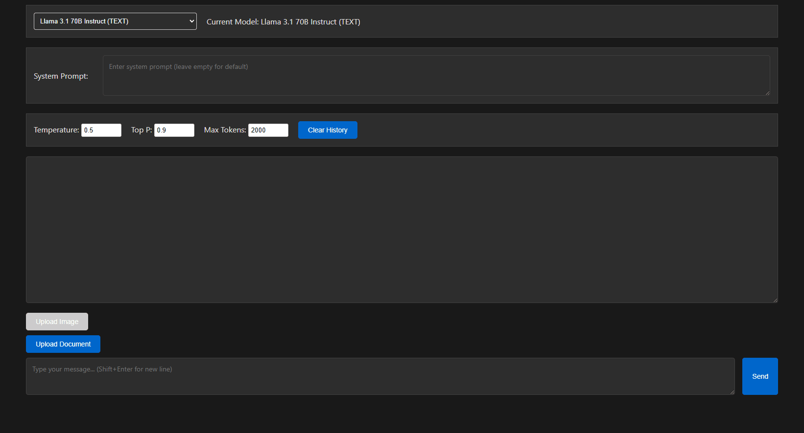

# Amazon Bedrock Chat Interface

A simple Flask-based web application that provides a user-friendly conversation interface for interacting with Amazon Bedrock's Language Models (LLMs).



## Features

- Clean and intuitive web interface for LLM interactions
- Support for all Amazon Bedrock models that have enabled `Converse` API
- Customizable model parameters:
  - Temperature
  - Top P
  - Max Tokens
- System prompt configuration
- Support for image and document uploads
- Real-time model switching

## Prerequisites

- Python 3.x
- AWS Account with Amazon Bedrock access
- AWS Credentials configured

## Installation

1. Clone the repository:
```bash
git clone https://github.com/yourusername/bedrock-chat-interface.git
cd bedrock-chat-interface
```

2. Create and activate a virtual environment (optional but recommended):
```bash
python -m venv venv
source venv/bin/activate  # On Windows: venv\Scripts\activate
```

3. Install required packages:
```bash
pip install -r requirements.txt
```

4. Set up your AWS credentials in `.env` file:
```
AWS_ACCESS_KEY_ID=your_access_key
AWS_SECRET_ACCESS_KEY=your_secret_key
AWS_DEFAULT_REGION=your_region
```

## Usage

1. Start the Flask server:
```bash
python server_script.py
```

2. Open your web browser and navigate to the default address (port can be changed in the main script):
```
http://localhost:5000
```

3. Select your desired model and configure parameters as needed

## Project Structure

```
bedrock-chat-interface/
├── templates/
│   └── index.html
├── server_script.py
├── requirements.txt
├── .env
└── README.md
```

## Contributing

Feel free to submit issues, fork the repository, and create pull requests for any improvements.

## License

This project is licensed under the MIT License - see the LICENSE file for details.

---
